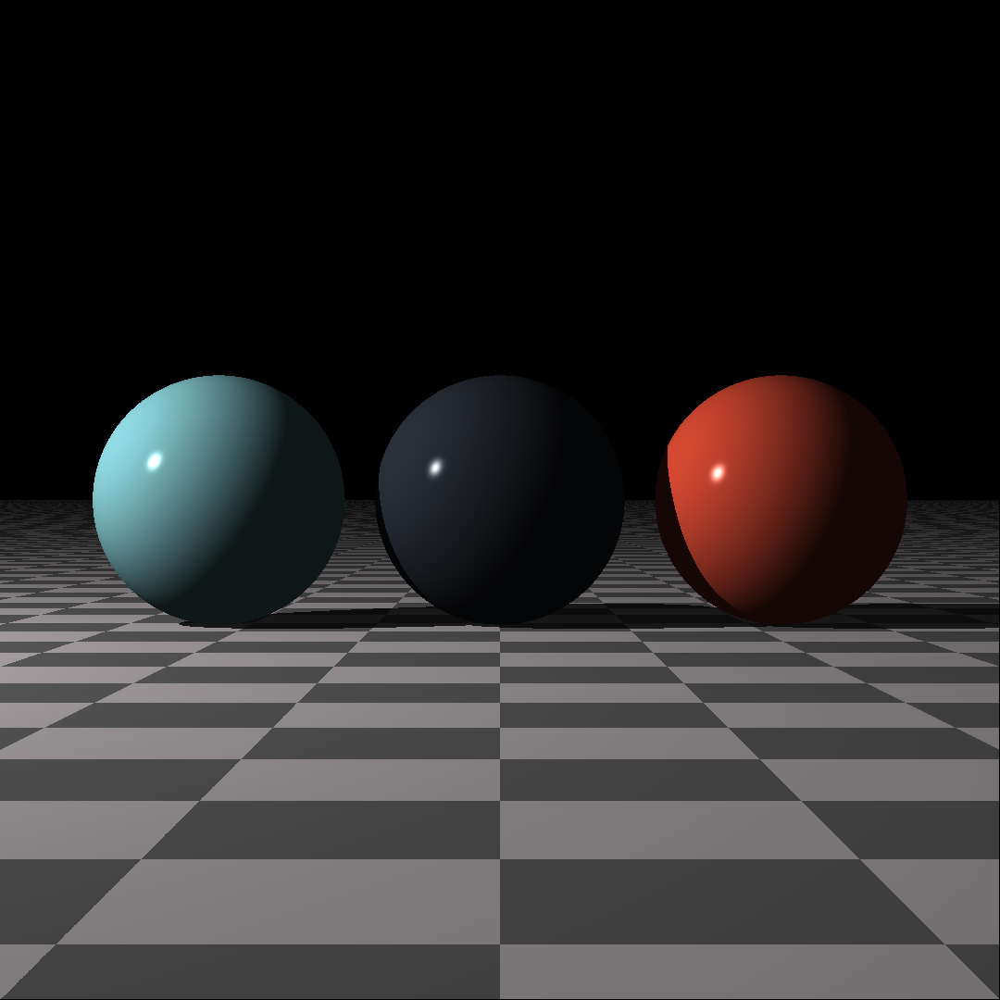

# Rendering from Scratch with Rust
Implementing *The Ray Tracer Challenge* by James Buck in `Rust` 🦀

# To dos:

- [ ] Fix scaling to modify current values instead of overwriting
- [ ] Make scaling change radius
- [ ] Add point() and vector() functions for better standardization
- [ ] Fix sphere origin so it can be set by either origin or translation. Currently somewhat broken
- [ ] Try calculating comps.over_point only for shadowed points
- [ ] Figure out what's wrong with rotation_z() function